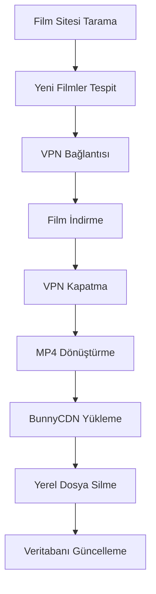

# Film Yönetim Sistemi

Otomatik film indirme, işleme ve CDN yükleme sistemi. Bu sistem film sitelerinden son eklenen filmleri tarar, ProtonVPN üzerinden güvenli şekilde indirir, MP4 formatına dönüştürür ve BunnyCDN'e yükler.

## 🎬 Özellikler

- **Otomatik Film Tarama**: Belirlenen film sitesinden yeni filmleri otomatik tespit
- **VPN Entegrasyonu**: ProtonVPN ile güvenli indirme (Türkiye sunucuları)
- **Akıllı İndirme**: Türkçe dublaj önceliği ile yüksek kalite seçimi
- **Format Dönüştürme**: Tüm videoları MP4 formatına otomatik dönüştürme
- **CDN Yükleme**: BunnyCDN'e otomatik yükleme ve yerel dosya temizliği
- **Web Arayüzü**: Kullanıcı dostu admin paneli
- **Gerçek Zamanlı İzleme**: Canlı ilerleme takibi ve hata raporlama
- **Batch İşleme**: 15-20 film toplu işleme desteği

## 🚀 Kurulum

### Sistem Gereksinimleri

- Python 3.8+
- Ubuntu/Debian Linux
- Minimum 4GB RAM
- 50GB+ boş disk alanı
- İnternet bağlantısı

### Gerekli Bağımlılıklar

```bash
# Sistem paketleri
sudo apt update
sudo apt install -y python3 python3-pip ffmpeg curl wget

# Chrome/Chromium (Selenium için)
sudo apt install -y chromium-browser

# ProtonVPN CLI (opsiyonel)
wget -q -O - https://repo.protonvpn.com/debian/public_key.asc | sudo apt-key add -
echo 'deb https://repo.protonvpn.com/debian stable main' | sudo tee /etc/apt/sources.list.d/protonvpn.list
sudo apt update
sudo apt install -y protonvpn
```

### Python Kurulumu

1. **Repo'yu klonlayın:**
```bash
git clone https://github.com/username/film-yonetim-sistemi.git
cd film-yonetim-sistemi
```

2. **Virtual environment oluşturun:**
```bash
python3 -m venv venv
source venv/bin/activate  # Linux/Mac
# veya
venv\Scripts\activate  # Windows
```

3. **Bağımlılıkları yükleyin:**
```bash
pip install -r requirements.txt
```

4. **Konfigürasyon dosyasını oluşturun:**
```bash
cp .env.example .env
```

5. **.env dosyasını düzenleyin:**
```env
# Flask ayarları
SECRET_KEY=your-very-secure-secret-key-here
DEBUG=False

# BunnyCDN ayarları (ZORUNLU)
BUNNYCDN_STORAGE_ZONE_NAME=your-storage-zone-name
BUNNYCDN_ACCESS_KEY=your-bunnycdn-access-key
BUNNYCDN_REGION=ny

# ProtonVPN ayarları (opsiyonel)
PROTONVPN_USERNAME=your-protonvpn-username
PROTONVPN_PASSWORD=your-protonvpn-password
PROTONVPN_SERVER=TR#1

# Film sitesi ayarları
TARGET_MOVIE_SITE=https://example-movie-site.com

# İndirme ayarları
DOWNLOAD_PATH=./downloads
MAX_DOWNLOADS_PER_SESSION=20
PREFERRED_QUALITY=1080p
```

## 🔧 Konfigürasyon

### BunnyCDN Kurulumu

1. [BunnyCDN](https://bunnycdn.com) hesabı oluşturun
2. Yeni bir Storage Zone oluşturun
3. Access Key'i alın
4. `.env` dosyasına bilgileri girin

### ProtonVPN Kurulumu (Opsiyonel)

1. [ProtonVPN](https://protonvpn.com) hesabı oluşturun
2. Kullanıcı adı ve şifrenizi `.env` dosyasına girin
3. İlk çalıştırmada otomatik kurulum yapılacak

### Film Sitesi Konfigürasyonu

Film sitesinin URL'sini `.env` dosyasında `TARGET_MOVIE_SITE` olarak belirleyin. Sistem çeşitli site yapılarına uyum sağlar.

## 🎯 Kullanım

### Web Arayüzü ile Kullanım

1. **Sistemi başlatın:**
```bash
python app.py
```

2. **Tarayıcıda açın:**
```
http://localhost:5000
```

3. **İşlem adımları:**
   - Ana sayfada "İşlemi Başlat" butonuna tıklayın
   - Sistem otomatik olarak:
     - Film sitesini tarar
     - ProtonVPN'e bağlanır
     - Filmleri indirir
     - MP4'e dönüştürür
     - BunnyCDN'e yükler
     - Yerel dosyaları temizler

### Komut Satırı Kullanımı

```bash
# Direkt film işleme
python -c "
from app import process_movies
process_movies()
"

# Sadece test
python -c "
from modules.vpn_manager import VPNManager
vpn = VPNManager()
print('VPN Test:', vpn.test_connection())
"
```

## 📊 Web Arayüzü

### Ana Sayfa
- **Kontrol Paneli**: Başlat/Durdur butonları
- **İlerleme Takibi**: Gerçek zamanlı progress bar
- **Sistem Durumu**: VPN, CDN, İndirme durumları
- **Hata Kayıtları**: Detaylı hata logları
- **Hızlı İşlemler**: Test ve temizlik butonları

### Dashboard
- **İstatistikler**: Film sayıları, dosya boyutları
- **Grafik Analizler**: Aylık trendler
- **Son Filmler**: En son eklenen filmler

### Film Listesi
- **Arama ve Filtreleme**: Başlık, tür, yıl
- **Sayfalama**: Performanslı listeleme
- **Detay Görünüm**: Film bilgileri ve linkler

### Ayarlar
- **Konfigürasyon**: Tüm ayarları web'den değiştirme
- **Test İşlemleri**: VPN ve CDN bağlantı testleri
- **Sistem Bilgileri**: Durum ve sağlık kontrolleri

## 🔄 İşlem Akışı



## 🛠️ Modül Yapısı

### Core Modüller

- **`app.py`**: Ana Flask uygulaması
- **`config.py`**: Konfigürasyon yönetimi
- **`modules/database.py`**: Veritabanı işlemleri
- **`modules/movie_scraper.py`**: Film sitesi tarama
- **`modules/vpn_manager.py`**: ProtonVPN yönetimi
- **`modules/download_manager.py`**: yt-dlp ile indirme
- **`modules/bunnycdn_uploader.py`**: BunnyCDN yükleme

### Web Arayüzü

- **`templates/`**: HTML şablonları
- **`static/css/`**: Özel CSS dosyaları
- **`static/js/`**: JavaScript uygulamaları

## 📝 API Dokümantasyonu

### Ana Endpoint'ler

```http
POST /api/start_processing
# İşlemi başlatır

POST /api/stop_processing  
# İşlemi durdurur

GET /api/status
# Anlık durum bilgisi

GET /api/movies?page=1&search=query
# Film listesi

POST /api/update_settings
# Ayarları günceller
```

### Örnek API Kullanımı

```javascript
// İşlem başlatma
fetch('/api/start_processing', {
    method: 'POST',
    headers: {'Content-Type': 'application/json'}
})
.then(response => response.json())
.then(data => console.log(data));

// Durum sorgulama
fetch('/api/status')
.then(response => response.json())
.then(status => {
    console.log('İşlem durumu:', status.is_running);
    console.log('İlerleme:', status.progress);
});
```

## 🚨 Hata Giderme

### Yaygın Sorunlar

**1. VPN Bağlantı Hatası**
```bash
# ProtonVPN'i manuel kurun
sudo apt install protonvpn
protonvpn-cli login your-username
```

**2. FFmpeg Hatası**
```bash
# FFmpeg'i kurun
sudo apt install ffmpeg
```

**3. Selenium Hatası**
```bash
# Chrome/Chromium kurun
sudo apt install chromium-browser
```

**4. BunnyCDN Yükleme Hatası**
- Access Key'i kontrol edin
- Storage Zone adını doğrulayın
- Bölge ayarını kontrol edin

### Log Dosyaları

```bash
# Ana log dosyası
tail -f movie_manager.log

# Flask debug logs
export FLASK_ENV=development
python app.py
```

### Debug Modu

```bash
# Debug modda çalıştırma
export DEBUG=True
python app.py
```

## 🔒 Güvenlik

### Önerilen Güvenlik Ayarları

1. **Güçlü SECRET_KEY** kullanın
2. **HTTPS** ile çalıştırın (production'da)
3. **Firewall** kuralları ayarlayın
4. **VPN** her zaman aktif tutun
5. **Logları** düzenli kontrol edin

### Production Deployment

```bash
# Gunicorn ile production deployment
pip install gunicorn
gunicorn -w 4 -b 0.0.0.0:5000 app:app

# Nginx reverse proxy örneği
server {
    listen 80;
    server_name your-domain.com;
    
    location / {
        proxy_pass http://127.0.0.1:5000;
        proxy_set_header Host $host;
        proxy_set_header X-Real-IP $remote_addr;
    }
}
```

## 📈 Performans Optimizasyonu

### Sistem Optimizasyonu

- **RAM**: Minimum 4GB, önerilen 8GB+
- **Disk**: SSD kullanımı önerilir
- **Network**: Minimum 100Mbps indirme hızı
- **CPU**: Multi-core önerilir

### Uygulama Optimizasyonu

```python
# config.py içinde
MAX_DOWNLOADS_PER_SESSION = 10  # Düşük sistem için
PREFERRED_QUALITY = '720p'      # Daha hızlı indirme
```

## 🤝 Katkıda Bulunma

1. Fork yapın
2. Feature branch oluşturun (`git checkout -b feature/amazing-feature`)
3. Commit yapın (`git commit -m 'Add amazing feature'`)
4. Push yapın (`git push origin feature/amazing-feature`)
5. Pull Request oluşturun

## 📄 Lisans

Bu proje MIT lisansı altında lisanslanmıştır. Detaylar için `LICENSE` dosyasına bakın.

## 🆘 Destek

- **Issues**: GitHub Issues kullanın
- **Documentation**: Wiki sayfalarını kontrol edin
- **Community**: Discussions bölümünde soru sorun

## 🔄 Güncelleme Geçmişi

### v1.0.0 (2024-01-XX)
- İlk stabil sürüm
- Temel film indirme ve yükleme
- Web arayüzü
- VPN entegrasyonu
- BunnyCDN desteği

### Planlanan Özellikler

- [ ] Çoklu film sitesi desteği
- [ ] Gelişmiş filtreleme seçenekleri
- [ ] Otomatik kalite optimizasyonu
- [ ] Email bildirimleri
- [ ] REST API genişletmesi
- [ ] Docker container desteği
- [ ] Kubernetes deployment

## 📞 İletişim

- **Geliştirici**: [Your Name]
- **Email**: your.email@example.com
- **GitHub**: [@username](https://github.com/username)

---

⭐ Bu projeyi beğendiyseniz star vermeyi unutmayın!
